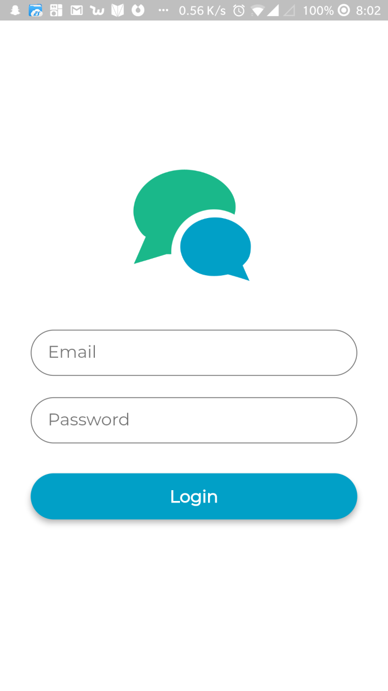

## Flutter login UI.

A beautiful login UI with Flutter

## Getting Started

1.  Clone this repository and cd into it
2.  Launch Android emulator or IOS simulator
3.  Run the app : `flutter run`
4.  See the [tutorial](https://pusher.com/tutorials/login-ui-flutter) for useful notes

### Prerequisites

- Flutter
- Dart

## Built With

- [Flutter](https://flutter.io) - Flutter
